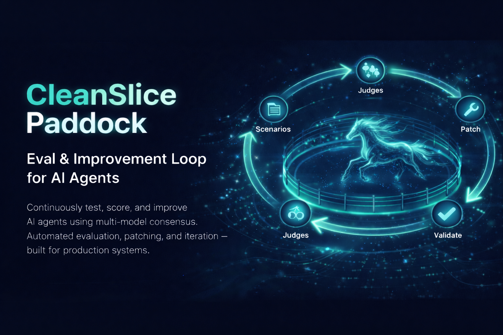

<p align="center">
  
</p>

# Paddock

Automated eval & improvement loop for AI agents. Generates test scenarios, runs the agent, scores with multi-model consensus (Claude + GPT + Gemini), and iteratively patches code until quality targets are met.

## How It Works

```
Scenarios (.yml) → Agent Runtime (mock channel) → 3 LLM Judges → Consensus
                                                                     │
                                                              pass ≥ 80%?
                                                             /           \
                                                           YES            NO
                                                            │              │
                                                       git push      Analyze + Patch
                                                                          │
                                                                    Sandbox OK?
                                                                   /          \
                                                                 YES          NO
                                                                  │            │
                                                              Commit        Revert
                                                                  │
                                                              ← repeat
```

1. **Load scenarios** from `.paddock/scenarios/` in the target project (YAML files organized by category)
2. **Run each scenario** against the agent via a mock channel — captures responses, tool calls, errors, timing
3. **3 LLM judges** (Claude, Gemini, GPT) independently score each run on correctness, tool usage, SOUL compliance, response quality, error handling
4. **Consensus**: median scores + majority vote → pass/fail/partial
5. **If failing**: analyzer finds patterns, patcher generates code fixes, sandbox validates (type-check + build)
6. **Repeat** until pass rate ≥ threshold or budget exhausted
7. **Git**: all work on `eval/*` branches, push on success

## Install

```bash
git clone https://github.com/cleanslice/paddock.git
cd paddock
bun install
cp .env.example .env
# Add your API keys to .env
```

### Requirements

- [Bun](https://bun.sh/) runtime
- At least one LLM API key (Claude preferred, Gemini/GPT optional for multi-judge consensus)

### Environment Variables

```bash
# Required (at least one)
CLAUDE_CODE_OAUTH_TOKEN=token1,token2,token3   # Comma-separated, auto-rotation on rate limit
ANTHROPIC_API_KEY=sk-ant-...                    # Fallback

# Optional (for 3-judge consensus)
GEMINI_API_KEY=AIza...
OPENAI_API_KEY=sk-...

# Optional overrides
EVAL_REPO_ROOT=/path/to/agent-repo
EVAL_AGENT_DIR=/path/to/agent-repo/.agent
EVAL_LLM_MODEL=claude-sonnet-4-20250514
```

## Usage

### CLI

```bash
# Full eval loop (10 scenarios, auto-improve, git branch + push)
bun run eval --repo /path/to/agent-repo

# Quick smoke test (3 scenarios, no improvement)
bun run eval:quick --repo /path/to/agent-repo

# Evaluate only, no code changes
bun run eval:no-improve --repo /path/to/agent-repo

# Test specific category
bun run eval:category tool_use --repo /path/to/agent-repo

# Preview loaded scenarios
bun run scenarios --repo /path/to/agent-repo
```

### All CLI Flags

```
--repo           Path to agent runtime repo (required or set EVAL_REPO_ROOT)
--agent-dir      Path to .agent directory
--categories     Comma-separated: tool_use,memory,conversation,edge_case,multi_turn,error_recovery
--difficulties   Comma-separated: easy,medium,hard,adversarial
--count          Number of scenarios (default: 10)
--threshold      Pass rate 0-1 (default: 0.8)
--max-iter       Max improvement iterations (default: 5)
--no-improve     Evaluate only, skip auto-improvement
--no-push        Don't push to git
```

### MCP Server

Paddock runs as an MCP server so your agent can call it directly:

```bash
bun run mcp
```

Available MCP tools:

| Tool | Description |
|------|-------------|
| `eval_run` | Run full eval cycle |
| `eval_status` | Check progress |
| `eval_report` | Get detailed results |
| `eval_scenarios` | Preview scenarios |
| `eval_abort` | Stop running eval |

## Scenarios

Scenarios live in `.paddock/scenarios/` inside the **target project** (the agent being tested).

### Setup

```bash
# In your agent project:
cp -r /path/to/paddock/.paddock.example .paddock
```

Or paddock will auto-copy `.paddock.example` on first run if `.paddock/` doesn't exist.

### Directory Structure

```
your-agent-project/
└── .paddock/
    ├── config.json              # Eval settings (optional)
    └── scenarios/
        ├── tool_use/
        │   ├── web-search.yml
        │   └── file-ops.yml
        ├── conversation/
        ├── memory/
        ├── multi_turn/
        ├── edge_case/
        └── error_recovery/
```

### Scenario Format

```yaml
id: tool-web-search-basic
category: tool_use
difficulty: easy
name: Basic web search
description: User asks to search the web
expectedBehavior: Agent calls web_search immediately, summarizes results
messages:
  - text: "What's the weather in London?"
    from: eval-user
  - text: "And in Tokyo?"
    from: eval-user
    delayMs: 2000
successCriteria:
  - dimension: correctness
    description: Used search tool and returned results
    weight: 0.4
  - dimension: tool_usage
    description: Chose web_search tool
    weight: 0.3
  - dimension: response_quality
    description: Concise summary
    weight: 0.3
```

### Fields

| Field | Required | Description |
|-------|----------|-------------|
| `id` | yes | Unique kebab-case identifier |
| `category` | yes | `tool_use`, `memory`, `conversation`, `multi_turn`, `edge_case`, `error_recovery` |
| `difficulty` | yes | `easy`, `medium`, `hard`, `adversarial` |
| `name` | yes | Short human-readable name |
| `description` | yes | What this scenario tests |
| `expectedBehavior` | yes | What the agent should do |
| `messages` | yes | Array of `{text, from, delayMs?}` — the "user" messages |
| `successCriteria` | yes | Array of `{dimension, description, weight}` — weights sum to 1.0 |

### Dimensions

| Dimension | What It Measures |
|-----------|-----------------|
| `correctness` | Did the agent produce the right result? |
| `tool_usage` | Did it pick the right tools with correct params? |
| `soul_compliance` | Does the response match SOUL.md personality? |
| `response_quality` | Is the response clear, well-structured? |
| `error_handling` | How did it handle errors or edge cases? |

## Development

### Project Structure

```
paddock/
├── src/
│   ├── index.ts              # MCP server entry (stdio)
│   ├── cli.ts                # CLI entry
│   ├── types.ts              # All shared types
│   ├── runner/
│   │   ├── mock-channel.ts   # In-memory channel for testing
│   │   └── agent-runner.ts   # Boots agent, sends scenarios, captures traces
│   ├── scenario/
│   │   ├── loader.ts         # YAML file loader from .paddock/
│   │   └── generator.ts      # LLM-based scenario generation
│   ├── evaluator/
│   │   ├── judge.ts          # Single-model judge
│   │   ├── consensus.ts      # Multi-model consensus (median + majority vote)
│   │   ├── criteria.ts       # Scoring prompt template
│   │   └── providers/        # Claude, Gemini, OpenAI judge implementations
│   ├── improver/
│   │   ├── analyzer.ts       # Failure pattern detection
│   │   ├── patcher.ts        # LLM-generated code patches
│   │   └── sandbox.ts        # Type-check + build validation
│   ├── git/
│   │   └── branch-manager.ts # Git branch operations
│   ├── loop/
│   │   ├── orchestrator.ts   # Main eval loop state machine
│   │   └── budget.ts         # Iteration/time/cost limits
│   └── mcp/
│       └── server.ts         # MCP tool definitions
├── .paddock.example/         # Default scenarios (copied to target projects)
├── package.json
└── tsconfig.json
```

### Key Concepts

**Mock Channel** — Implements `IChannelGateway` from the agent runtime. Captures all outbound messages. Provides `simulateIncoming()` and `waitForAllResponses()` for programmatic testing.

**Tracing Proxy** — Wraps each agent tool to record params, results, timing, errors. Dangerous tools (exec, shutdown, etc.) are blocked and return stubs.

**Consensus Engine** — Runs N judges in parallel. Per-dimension score = median (robust to outliers). Verdict = majority vote. Agreement < 50% → "partial" (flagged for human review).

**Patcher Safety** — Can only modify files matching allowlist (`.agent/SOUL.md`, `src/slices/**/*.ts`, etc.). Max 200 lines per patch. Type-check gate after every patch. Auto-revert on failure.

### Commands

```bash
bun run eval          # Full eval loop
bun run eval:quick    # 3 scenarios, no improve
bun run eval:full     # 10 scenarios with improve
bun run scenarios     # Preview scenarios
bun run mcp           # Start MCP server
bun run typecheck     # Type-check
```

### Adding a Judge Provider

Create `src/evaluator/providers/your-provider.ts` implementing `JudgeProvider`:

```typescript
import type { JudgeProvider } from "../../types"

export class YourProvider implements JudgeProvider {
  name = "your-model"
  model: string

  constructor(apiKey: string, model = "your-model-id") {
    this.model = model
  }

  async complete(prompt: string): Promise<string> {
    // Call your LLM API, return raw text
  }
}
```

Register it in `src/evaluator/providers/factory.ts`.

### Runtime Integration

Paddock requires a small change in the target agent's channel system — adding a `mock` channel type:

```typescript
// In channel.types.ts:
export type ChannelConfig =
  | { type: "telegram"; token: string }
  | { type: "slack"; botToken: string; appToken: string }
  | { type: "mock"; instance: IChannelGateway }  // ← for Paddock

// In channel.gateway.ts:
case "mock":
  return config.instance
```

## License

MIT
